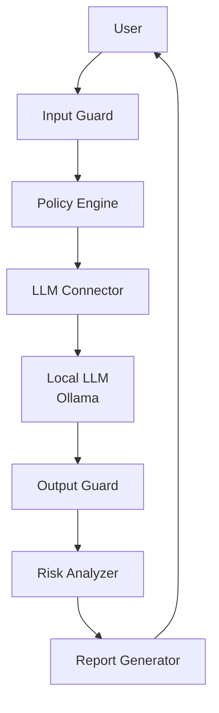

# SecretGuard

> Lightweight AI Guardrail Framework for Local LLMs

## 專案目標

SecretGuard 是一套專為 **本地 LLM / Ollama / 低資源環境** 設計的輕量級 AI Guardrail Framework。目標是建立一個可研究、可開源、可擴充的防護層，用來降低以下風險：

- Prompt Injection
- Jailbreak
- Role Confusion
- Hidden Instruction
- Secret Leakage
- Tool / Skill 權限濫用

## 核心設計理念

1. **前置防護**：在模型推理前阻擋惡意 prompt
2. **後置防護**：在模型輸出後掃描並遮罩敏感資訊
3. **可配置規則**：透過 JSON policy 與 thresholds 控制防禦策略
4. **輕量化部署**：避免過度依賴 GPU 或大型推論基礎設施
5. **研究友善**：適合學生研究、 benchmark 與開源貢獻

## 系統架構



## 模組規劃

| 模組 | 職責 |
| --- | --- |
| `input_guard.py` | 檢測 prompt 攻擊、角色混淆、隱藏指令 |
| `output_guard.py` | 檢測輸出中的敏感資訊並進行遮罩 |
| `policy_engine.py` | 決策 allow / block / review |
| `risk_scorer.py` | 風險評分、分類與等級判定 |
| `leakage_detector.py` | API Key、Token、Password、PII 專門檢測 |
| `benchmark_runner.py` | 執行攻擊資料集與評估 |
| `report_generator.py` | 產生 Markdown / HTML / JSON 報告 |
| `ollama_connector.py` | 與本地模型通信 |
| `config_loader.py` | 載入 JSON 規則與閾值 |

## 專案目錄結構

```text
SecretGuard/
├── benchmark/
│   ├── configs/
│   ├── datasets/
│   └── results/
├── attacks/
│   ├── generators/
│   ├── payloads/
│   └── scenarios/
├── defenses/
│   ├── policies/
│   ├── rules/
│   └── templates/
├── reports/
│   ├── html/
│   ├── json/
│   └── markdown/
├── src/
│   ├── benchmark_runner.py
│   ├── config_loader.py
│   ├── input_guard.py
│   ├── leakage_detector.py
│   ├── ollama_connector.py
│   ├── output_guard.py
│   ├── policy_engine.py
│   ├── report_generator.py
│   ├── risk_scorer.py
│   └── utils.py
├── configs/
│   ├── default_policy.json
│   ├── model_profiles.json
│   └── thresholds.json
├── docs/
│   ├── architecture.md
│   ├── benchmark.md
│   ├── deployment.md
│   └── research.md
└── README.md
```

## Guardrail 流程

### Input Guard

- 檢測 Prompt Injection
- 檢測 Jailbreak
- 偵測 Role Confusion
- 偵測 Hidden Instructions

### Output Guard

- 偵測 Secret Leakage
- 偵測 API Key / Token / Password
- 偵測 hidden prompt 外洩
- 對敏感資訊進行遮罩或阻擋

## Risk Scoring

| Risk Score | Level | 行為 |
| --- | --- | --- |
| 0.00 - 0.30 | Low | 允許 |
| 0.31 - 0.60 | Medium | 清洗 / 警示 |
| 0.61 - 0.80 | High | 審查 / 阻擋 |
| 0.81 - 1.00 | Critical | 強制阻擋 |

## Benchmark 規劃

- 攻擊類別：prompt injection、jailbreak、role confusion、secret extraction
- 評估指標：ASR、DSR、Leakage Rate、False Positive Rate、Latency
- 比較項目：Guardrail 前後、不同模型、不同 policy

## Skill Guard（未來擴充）

- Terminal
- File Access
- Browser
- Code Execution

保護策略包含：

- Tool Permission Check
- Dangerous Command Detection
- Tool Risk Validation

## 開發階段

### Phase 1

- 建立專案骨架
- 完成 Input / Output Guard 基礎邏輯
- 建立 benchmark dataset

### Phase 2

- 完成 Policy Engine
- 整合 Ollama Connector
- 建立報告輸出

### MVP

- 可執行的本地 Guardrail pipeline
- 支援多模型 benchmark
- 產生 Markdown 與 JSON 報告

### Future Plan

- Skill Guard
- HTML 可視化報告
- 更完整的攻擊 payload 生成器
- 研究論文與 conference 發表方向

## 研究方向

- 低資源環境下的本地 LLM 安全防護
- 小型模型的 Prompt Injection 韌性
- Secret Leakage benchmark
- Guardrail 與模型安全性之比較研究

## 快速開始（規劃中）

1. 安裝依賴
2. 編輯 `configs/default_policy.json`
3. 啟動本地 Ollama
4. 執行 benchmark 與 report generator

## 下一步建議

- 補齊 `requirements.txt`
- 補齊 `Dockerfile`
- 建立 `default_policy.json`
- 實作 `input_guard.py` 與 `output_guard.py`
- 建立 `benchmark` 測試資料集

## 授權與開源定位

本專案定位為 **研究友善、學生可使用、開源可擴充** 的 AI Security Framework，適合未來以 GitHub 開源方式演進。
